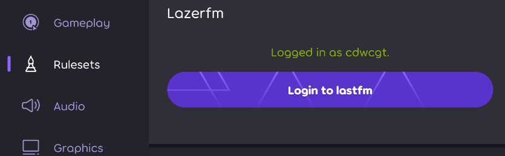

# Lazerfm

this is a plugin for [osu!lazer](https://github.com/ppy/osu), It cab connects lazer to your [LastFM](https://www.last.fm/) account.

## How to use it

[Sentakki ruleset install guild](https://github.com/LumpBloom7/sentakki/wiki/Ruleset-installation-guide)

Download [release](https://github.com/cdwcgt/Lazerfm/Release) and then put it to your rulesets folder in lazer data folder.

Open game settings and you will find Lazerfm in rulesets subsection.

click "Login to lastfm", this will open LastFm's login page.

after you login, your "Now playing" and "Scrobble" will sync to lastFm
